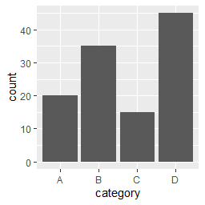

# geom_bar

ggplot2のgeom_barは、カテゴリごとのデータの数値を棒グラフで描画するために使用されます。以下は、geom_barを使用して棒グラフを作成するための簡単なサンプルコードです。

``` r
library(ggplot2)

# データセットの作成
df <- data.frame(
  category = c("A", "B", "C", "D"),
  count = c(20, 35, 15, 45)
)

# 棒グラフの作成
ggplot(data = df, aes(x = category, y = count)) + 
  geom_bar(stat = "identity")
```

このコードは、4つのカテゴリとそれぞれの数値を持つデータフレームを作成し、それを使用して棒グラフを作成しています。ggplot()関数はグラフのデータを指定し、aes()関数はx軸とy軸の変数を指定します。geom_bar()関数は、データの棒グラフを作成するために使用されます。stat = "identity"を指定することで、データフレームの数値がそのまま棒グラフに反映されます。

このコードを実行すると、以下のような棒グラフが表示されます。



このグラフは、x軸にカテゴリ（A、B、C、D）、y軸に数値が表示されます。各カテゴリに対応する棒グラフの高さが、データフレームで指定された数値に基づいて変化します。棒グラフは、カテゴリごとの数値を比較するのに便利なグラフです。また、geom_bar()関数には、グラフの色や横軸と縦軸の位置などを変更するためのオプションがあります。
