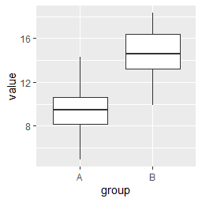

# geom_boxplot

ggplot2のgeom_boxplotは、データの分布を箱ひげ図で描画するために使用されます。以下は、geom_boxplotを使用して箱ひげ図を作成するための簡単なサンプルコードです。

``` r
library(ggplot2)

# データセットの作成
df <- data.frame(
  group = rep(c("A", "B"), each = 50),
  value = c(rnorm(50, 10, 2), rnorm(50, 15, 2))
)

# 箱ひげ図の作成
ggplot(data = df, aes(x = group, y = value)) + 
  geom_boxplot()
```

このコードは、2つのグループに属する50個の数値を持つデータフレームを作成し、それを使用して箱ひげ図を作成しています。ggplot()関数はグラフのデータを指定し、aes()関数はx軸とy軸の変数を指定します。geom_boxplot()関数は、データの箱ひげ図を作成するために使用されます。

このコードを実行すると、以下のような箱ひげ図が表示されます。



このグラフは、x軸にグループ（A、B）、y軸に数値が表示されます。各グループに属するデータの中央値、四分位範囲、外れ値を表す箱ひげ図が表示されます。箱の上端は第3四分位数、下端は第1四分位数を表し、箱の中央の線は中央値を表します。また、外れ値は、四分位範囲の1.5倍以上離れた値です。

箱ひげ図は、データの分布を視覚的に比較するのに便利なグラフです。また、geom_boxplot()関数には、グラフの色や枠線、中央値の点などを変更するためのオプションがあります。
