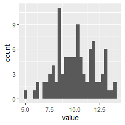

# geom_histogram

ggplot2のgeom_histogramは、データの分布をヒストグラムで描画するために使用されます。以下は、geom_histogramを使用してヒストグラムを作成するための簡単なサンプルコードです。

``` r
library(ggplot2)

# データセットの作成
df <- data.frame(
  value = rnorm(100, 10, 2)
)

# ヒストグラムの作成
ggplot(data = df, aes(x = value)) + 
  geom_histogram()
```

このコードは、平均値10、標準偏差2の正規分布に従う100個の数値を持つデータフレームを作成し、それを使用してヒストグラムを作成しています。ggplot()関数はグラフのデータを指定し、aes()関数はx軸の変数を指定します。geom_histogram()関数は、データのヒストグラムを作成するために使用されます。

このコードを実行すると、以下のようなヒストグラムが表示されます。



このグラフは、x軸に値が、y軸にデータの出現頻度が表示されます。データの分布がどのようになっているかを直感的に把握することができます。また、geom_histogram()関数には、binの幅や色、外側の枠線の太さなどを変更するためのオプションがあります。

ヒストグラムは、データの分布を視覚的に理解するのに便利なグラフです。ただし、ビンの数や幅の選択によって、データの解釈が異なる場合があるため、適切なパラメータの選択が重要です。