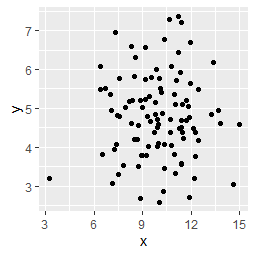

# geom_point

ggplot2のgeom_pointは、データを散布図として描画するために使用されます。以下は、geom_pointを使用して散布図を作成するための簡単なサンプルコードです。


``` R
library(ggplot2)

# データセットの作成
df <- data.frame(
  x = rnorm(100, 10, 2),
  y = rnorm(100, 5, 1)
)

# 散布図の作成
ggplot(data = df, aes(x = x, y = y)) + 
  geom_point()
```

このコードは、平均値10、標準偏差2の正規分布に従う100個の数値を持つxと、平均値5、標準偏差1の正規分布に従う100個の数値を持つyを持つデータフレームを作成し、それを使用して散布図を作成しています。ggplot()関数はグラフのデータを指定し、aes()関数はx軸とy軸の変数を指定します。geom_point()関数は、データの散布図を作成するために使用されます。

このコードを実行すると、以下のような散布図が表示されます。



このグラフは、x軸にxの値が、y軸にyの値が表示されます。それぞれの点は、xとyの値を持ちます。このグラフは、データ間の相関関係や分布の形状を直感的に把握することができます。

また、geom_point()関数には、点の色やサイズ、形状などを変更するためのオプションがあります。

散布図は、データの相関関係や分布の形状を理解するのに便利なグラフです。ただし、外れ値がある場合や、データの点の重なりが多い場合は、正確な解釈が難しいことがあります。そのため、適切な視覚化方法を選択する必要があります。
