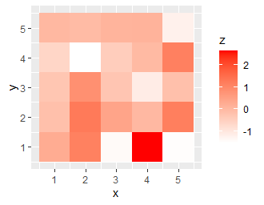

# geom_tile

ggplot2のgeom_tileは、二次元のデータを色付きのセルとして表示するために使用されます。以下は、geom_tileを使用してヒートマップを作成するための簡単なサンプルコードです。

``` R
library(ggplot2)

# データセットの作成
df <- data.frame(
  x = rep(1:5, each = 5),
  y = rep(1:5, times = 5),
  z = rnorm(25, 0, 1)
)

# ヒートマップの作成
ggplot(data = df, aes(x = x, y = y, fill = z)) +
  geom_tile() +
  scale_fill_gradient(low = "white", high = "red")
```

このコードは、5x5のグリッド状に並べられた25個の数値を持つデータフレームを作成し、それを使用してヒートマップを作成しています。ggplot()関数はグラフのデータを指定し、aes()関数はx軸とy軸の変数を指定し、fillオプションを使用して、z軸の値を色で表現するように指定しています。geom_tile()関数は、データのヒートマップを作成するために使用されます。scale_fill_gradient()関数は、ヒートマップの色のグラデーションを指定するために使用されます。

このコードを実行すると、以下のようなヒートマップが表示されます。



このグラフは、x軸とy軸の値に対応するセルがあり、それぞれのセルの色がz軸の値を表しています。このグラフは、データのパターンや傾向を視覚化することができます。たとえば、この例では、中央部分に赤いセルが集中していることから、その部分の値が他の部分よりも大きいことがわかります。

ヒートマップは、二次元のデータを可視化するために非常に有用です。しかし、色のグラデーションの設定やセルの大きさや間隔の調整など、デザイン上の調整が必要な場合があります。また、セルの数が非常に多い場合は、解釈が困難になることがあります。そのため、ヒートマップを使用する前に、データセットに適した視覚化方法を選択する必要があります。